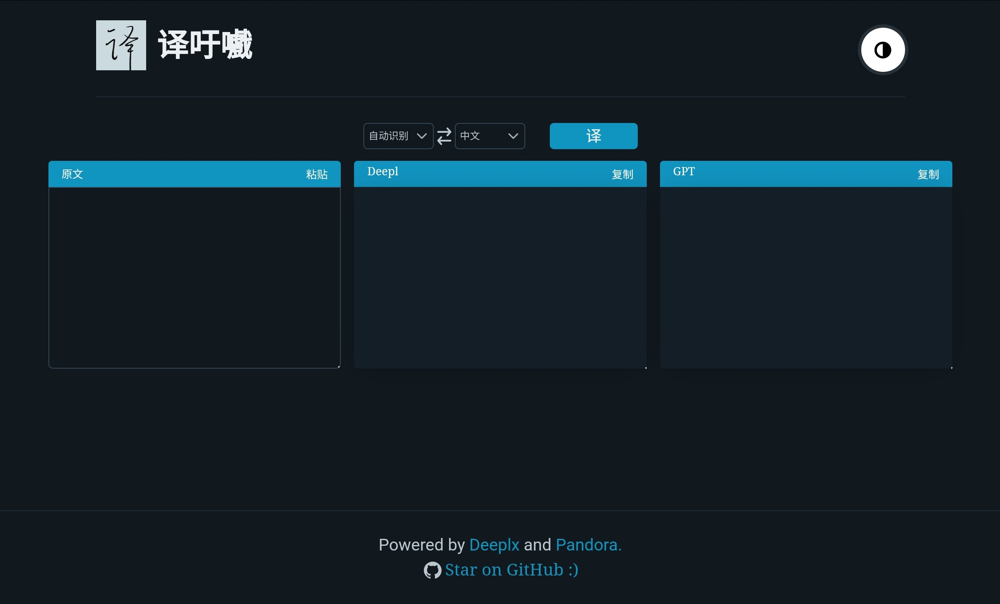
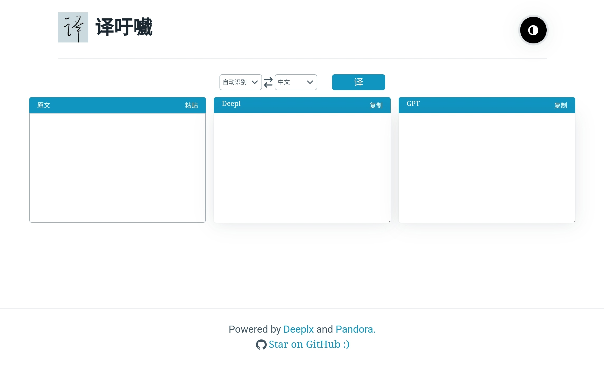
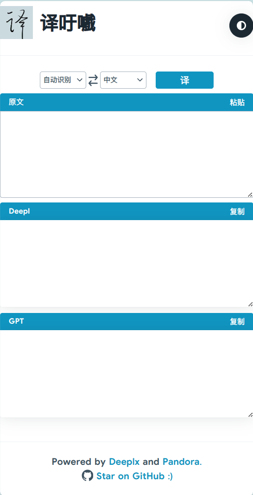
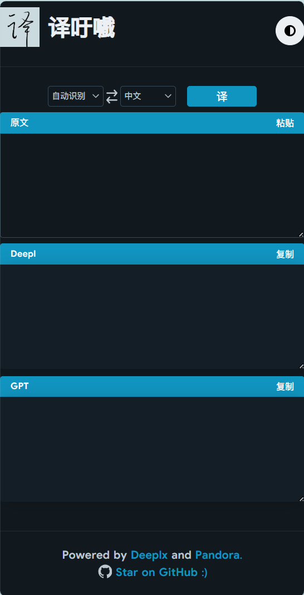

<h1 align="center">译吁嚱</h1>

<h5 align="center">一个支持Deepl & ChatGPT翻译的网页</h5>

<h6 align="center">青天难上，仍慕青山</h6>

----

# 特性

- 自动 / 手动 切换夜间模式
- ChatGPT翻译支持流式输出
- 自动根据译文长度同步拉伸文本框
- 可自由调节原文 / 译文 文本框高度
- 当源语言选定为"自动识别"时，gpt自己识别(随缘)
- 一键复制
- 一键粘贴原文(PC端浏览器需授权读取剪贴板，移动端暂时无效)
- 悬挂猫一键滚动至顶部
- 甚至能让ChatGPT翻译文言文(源语言选择"文言文")(质量不如文心一言(仅图一乐)
- 日志输出(仅当调用ChatGPT翻译时，可通过日志进行越狱行为审查)(格式：时间 |  IP |  IP位置 |  请求内容[:30])

# 界面预览

## PC

## Phone

> width < 1100px

# 使用

python版本为3.10.0，理论上py3都可

1. 在`main.py`中填写你的`gptApi` & `deeplApi`

2. `python ./main.py`(默认端口5000，可在`main.py`开头的`预设`部分找到`server_port`更改)

3. 后台运行：`nohup python ./main.py &`，终端日志会输出到项目根目录下的`nohup.out`

   关闭后台：`ps aux | grep python`，第二列的数字即进程PID，`kill -9 <PID>`

> 还有很多待完善的地方，在此表示抱歉

# 技巧

1. 通过[DeepLX](https://github.com/OwO-Network/DeepLX)项目(无需token!)作为Deepl接口(感谢`OwO-Network`大佬)

2. 通过`zhile`大佬[wozulong](https://github.com/wozulong)的fakeopen接口作为Deepl接口(可避免"rate limit") & GPT接口(感谢`zhile`大佬)

   > 如果使用了大佬的项目/接口，建议修改页面中页脚`footer`的链接&名称

# 感谢

- [DeepLX](https://github.com/OwO-Network/DeepLX)项目`OwO-Network`大佬，项目灵感的起源
- `zhile`大佬[wozulong](https://github.com/wozulong)，fakeopen接口
- [ChatGPT-Web](https://github.com/LiangYang666/ChatGPT-Web)项目，流式输出的实现
- 切图仔群友们

